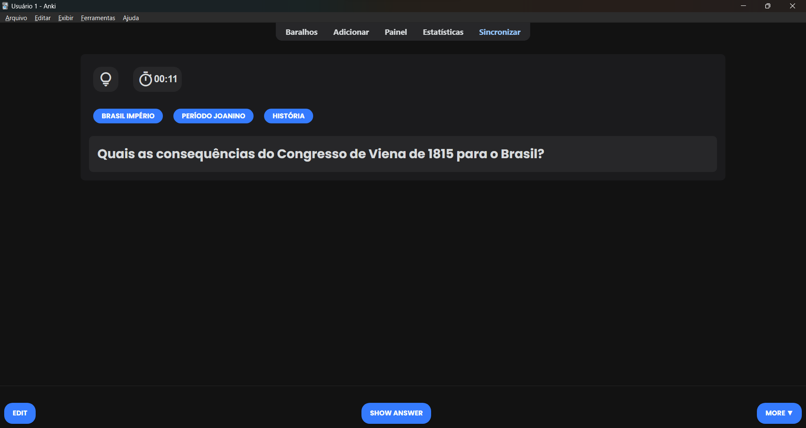
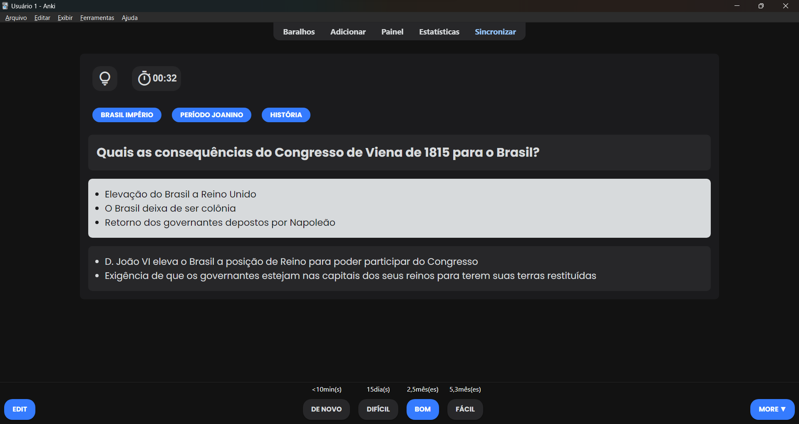
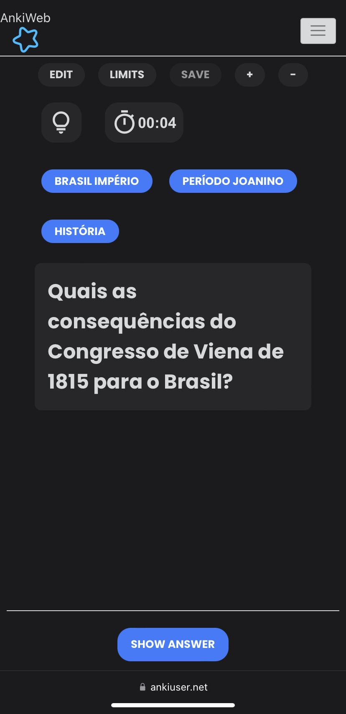
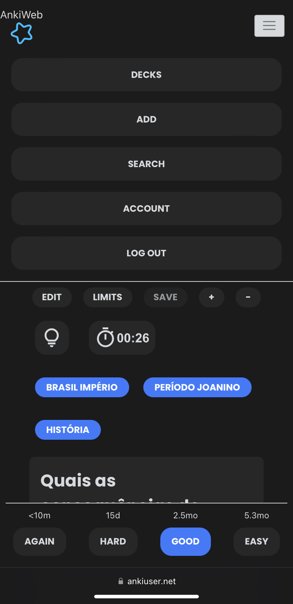
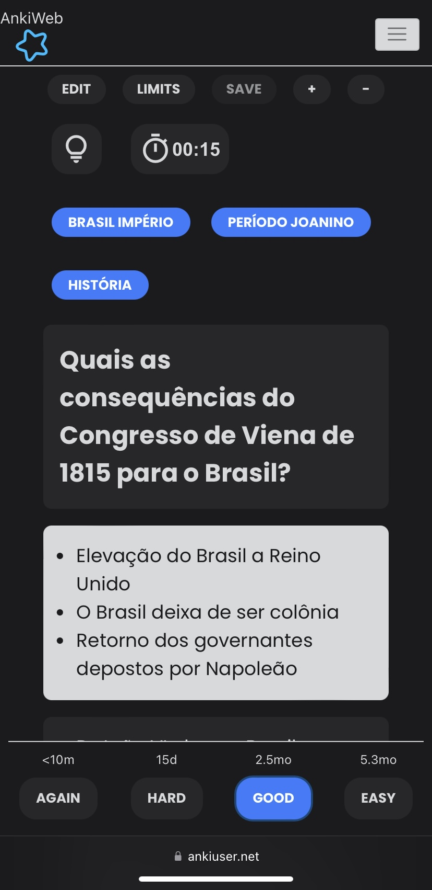
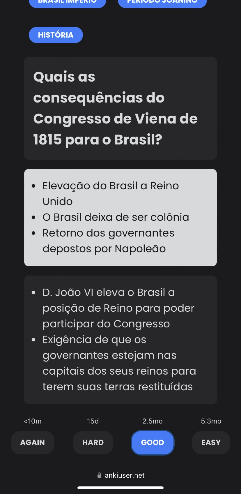

# Anki-Card-Templates 📚
A collection of my anki card templates, feel free to use it 😊

### Note about bottom bar buttons (Show Answer, Again, Hard, Good, Easy, More) - on Desktop App 💻
This template won't change the appearence of said buttons on Desktop App, only on mobile browser and desktop browser.
In order to change in them in the Desktop App, I used Beautify add-on.

### Note about mobile 📱
 I haven't tested this template on the mobile app, so I don't know if it works well there.
 If someone tests it, please let me know here if works.
 
### Note about timer ⏱️
The timer button is not synchronized with Anki's timer, so pausing it will not pause Anki's timer.

# Fields ✍️
There are six fields: front, back, extra, tip, and source.
Empty fields won't be displayed, so there is no need to fill them all.

In the upper left corner, the first button is for tips, and it is used to show or hide the tip field. Next to the tip button, there is a timer that indicates the time elapsed since the card was opened, you can pause it by clicking on it.

Below these two icons, there is a tag field that shows the card's tags as follows:
- Only the name after the last "::" is shown.
- Underscores ( _ ) are treated as spaces.

Thus, the tag "ENEM/UECE::Humanas::História::Brasil::Brasil_império," for example, will be displayed as "Brasil Império".

Just below, there are the following self-explanatory fields: Front, Back, Extra, and Tip.

# Front card - night version - on Desktop app 💻

# Back card - night version - on Desktop app 💻

# Front card - night version - on mobile browser 📱

# Back card - night version - on mobile browser 📱

# Credits 
This template uses Material Design icons by Google and Poppins font by Indian Type Foundry and Jonny Pinhorn

- Link to Google Icons:
https://fonts.google.com/icons
- Link to Poppins font on Google Fonts:
https://fonts.google.com/specimen/Poppins?query=poppins
